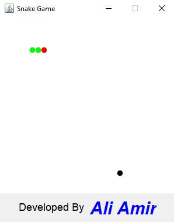

# Java Snake Game

Welcome to the **Java Snake Game** repository! This project is a classic implementation of the Snake game using Java. It provides a simple, interactive, and fun way to play Snake directly in your Java environment. Whether you're a beginner looking to understand Java GUI programming or a retro gaming enthusiast, this project is for you.

---

## Table of Contents

- [Features](#features)
- [Demo](#demo)
- [Installation](#installation)
- [How to Play](#how-to-play)
- [Project Structure](#project-structure)
- [Customization](#customization)
- [Contributing](#contributing)
- [License](#license)
- [Credits](#credits)

---

## Features

- Classic Snake gameplay
- Responsive keyboard controls
- Increasing difficulty as the snake grows
- Score tracking
- Game Over and restart functionality
- Simple and clean UI using Java Swing
- Easily extendable and customizable code base

---

## Demo



---

## Installation

### Prerequisites

- Java JDK 8 or higher
- Git (optional, for cloning)

### Steps

1. **Clone the repository:**

   ```bash
   git clone https://github.com/Ali-Amir-code/Java-Snake-Game.git
   cd Java-Snake-Game
   ```

2. **Compile the code:**

   ```bash
   javac src/*.java
   ```

3. **Run the game:**

   ```bash
   java -cp src Snake
   ```
---

## How to Play

- **Start the game:** Launch the program as described above.
- **Control the snake:** Use the arrow keys (`↑`, `↓`, `←`, `→`) to change the direction of the snake.
- **Eat food:** Move the snake to eat the food. Each time the snake eats, it grows longer and your score increases.
- **Avoid crashing:** Don’t let the snake crash into the walls or itself, or it's game over!
- **Restart:** After a game over, you can restart the game by pressing the appropriate button (if implemented).

---

## Project Structure

```
Java-Snake-Game/
├── src/com/aliamircode/
│   ├── Snake.java
│   ├── Board.java
├── README.md
└── LICENSE
```

- `src/`: Contains all Java source files.
- `assets/`: Contains images, screenshots, or other resources.
- `README.md`: Project documentation.
- `LICENSE`: License information.

---

## Customization

Want to add new features? Here are some ideas:

- Add sound effects
- Implement levels or increasing speed
- Add a high score tracker
- Change the snake or food appearance
- Add support for mobile or web deployment (JavaFX, HTML5, etc.)

Feel free to fork and modify the code as you like!

---

## Contributing

Contributions are welcome! If you’d like to submit a bug fix, enhancement, or new feature, please:

1. Fork the repository
2. Create your feature branch (`git checkout -b feature/my-feature`)
3. Commit your changes (`git commit -am 'Add my feature'`)
4. Push to the branch (`git push origin feature/my-feature`)
5. Open a [Pull Request](https://github.com/Ali-Amir-code/Java-Snake-Game/pulls)

---

## License

This project is licensed under the MIT License. See the [LICENSE](LICENSE) file for details.

---

## Credits

Developed by [Ali-Amir-code](https://github.com/Ali-Amir-code).

If you use or modify this project, please give credit and link back to the original repository!

---

Enjoy the game! 🚀🐍
